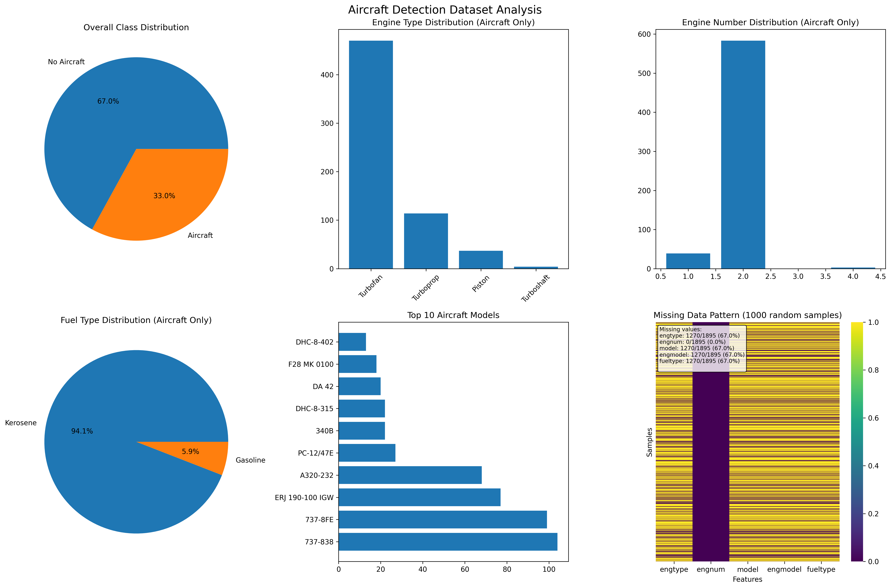

# Aircraft Detection from Audio - Multi-Class Classification

Deep learning system to classify aircraft characteristics from audio recordings using convolutional recurrent neural networks (CRNNs)

## Project Overview

Multi-class classification:

- **Engine Type** (Turbofan, Turboprop, Piston, Turboshaft)
- **Engine Number** (1, 2, 4 engines)
- **Fuel Type** (Kerosene, Gasoline)

## Dataset Analysis



### Dataset Structure
- **Total Recordings**: 1,895 audio files
- **Aircraft Recordings**: 625 (class=1)
- **No Aircraft Recordings**: 1,270 (class=0)
- **Audio Format**: WAV files
- **Duration**: Variable (typically 10-60 seconds)

### Target Classification Variables

#### 1. Engine Type (engtype) - 4 Classes
| Class | Count | Percentage | Balance Ratio |
|-------|-------|------------|---------------|
| Turbofan | 470 | 75.2% | 117.5:1 |
| Turboprop | 114 | 18.2% | 29.3:1 |
| Piston | 37 | 5.9% | 9.3:1 |
| Turboshaft | 4 | 0.6% | 1:1 |

#### 2. Engine Number (engnum) - 3 Classes
| Class | Count | Percentage | Balance Ratio |
|-------|-------|------------|---------------|
| 2 engines | 583 | 93.3% | 194.3:1 |
| 1 engine | 39 | 6.2% | 15.0:1 |
| 4 engines | 3 | 0.5% | 1:1 |

#### 3. Fuel Type (fueltype) - 2 Classes
| Class | Count | Percentage | Balance Ratio |
|-------|-------|------------|---------------|
| Kerosene | 588 | 94.1% | 15.9:1 |
| Gasoline | 37 | 5.9% | 1:1 |

### Data Quality Assessment
- **Missing Data**: All target variables have complete data for aircraft recordings (class=1)
- **Data Integrity**: No missing values in aircraft recordings for classification targets
- **Class Balance**: Highly imbalanced dataset requiring special handling strategies


### Audio Processing Pipeline
1. **Audio Loading**: Using librosa for audio file loading and resampling
2. **Segmentation**: Extract fixed-duration segments from variable-length recordings
3. **Feature Extraction**: Convert audio to mel-spectrograms using librosa
4. **Normalization**: Apply power-to-decibel conversion for better model training

### Model Architecture
- **Base Model**: Convolutional Neural Network
- **Input**: Mel-spectrogram images (time-frequency representations)
- **Layers**: Conv2D, MaxPooling2D, Dropout, BatchNormalization
- **Output**: Multi-class classification with softmax activation

### Training Strategy
- **Data Split**: Stratified train/validation/test split to maintain class proportions
- **Class Weights**: Applied to handle imbalanced class distributions
- **Data Augmentation**: Audio augmentation techniques for minority classes
- **Regularization**: Dropout and batch normalization to prevent overfitting

## Project Structure

```
drone-detection/
├── dataset/
│   ├── audio/                 # Audio files directory
│   ├── env_audio/            # Environment audio files
│   ├── sample_meta.csv       # Metadata with aircraft information
│   ├── environment_mappings_raw.csv
│   └── environment_class_mappings.csv
├── aircraft-detection-from-audio-binary-classifier.ipynb  # Main notebook
├── analyze_dataset.py         # Dataset analysis script
├── get_data.py               # Data download script
├── README.md                 # This file
├── requirements.txt          # Python dependencies
└── venv/                    # Virtual environment
```

## Key Features

### Multi-Class Classification
- **Engine Type Classification**: Distinguish between different propulsion systems
- **Engine Count Classification**: Identify number of engines (1, 2, or 4)
- **Fuel Type Classification**: Classify fuel type (Kerosene vs. Gasoline)

### Advanced Audio Processing
- **Mel-Spectrogram Generation**: Time-frequency representation of audio
- **Segment Extraction**: Handle variable-length audio recordings
- **Audio Augmentation**: Improve model robustness and handle class imbalance

### Model Optimization
- **Class Weight Balancing**: Address imbalanced dataset challenges
- **Regularization Techniques**: Prevent overfitting on limited data
- **Transfer Learning**: Leverage pre-trained models for better performance
